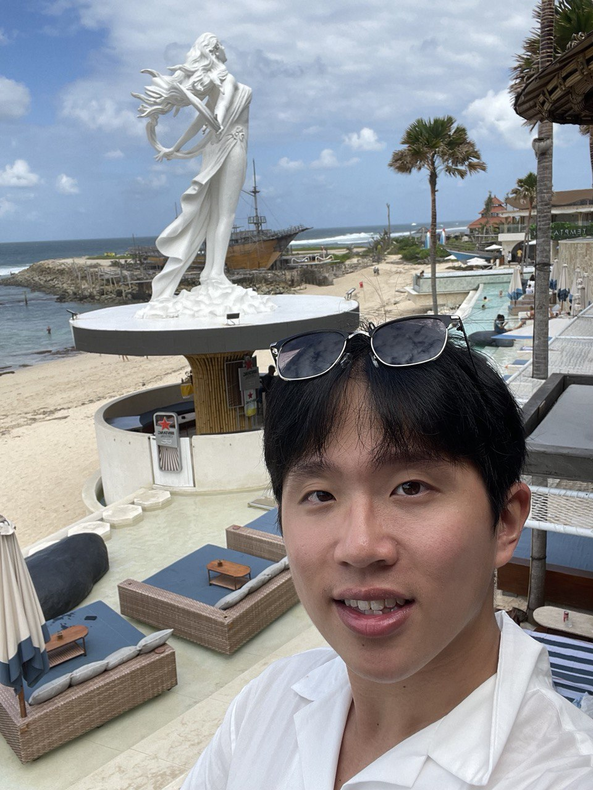
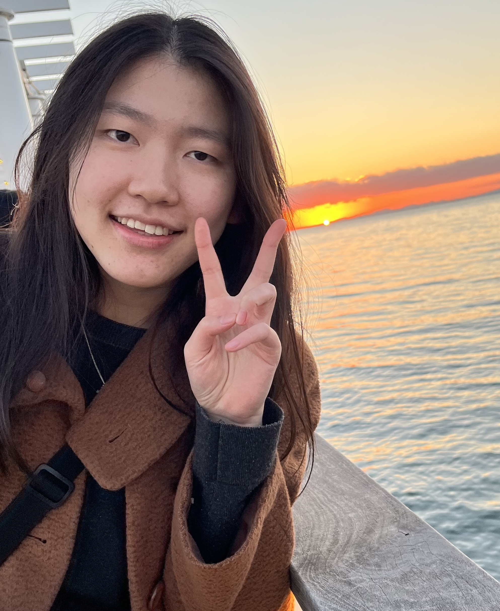
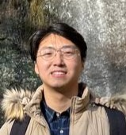
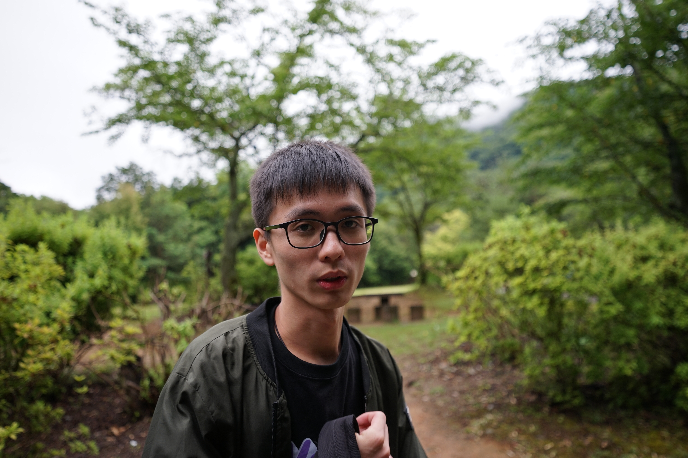

We are a team based in the [School of Computing, National University of Singapore](https://www.comp.nus.edu.sg).

You can reach us at the email `seer[at]comp.nus.edu.sg`

## Project team

### Eugene Christopher

[[homepage](http://www.comp.nus.edu.sg/~damithch)]
[[github](https://github.com/jon-seana)]
[[portfolio](team/johndoe.md)]

* Role: Project Member
* Responsibilities: Technical Lead

### Zhan Wen

[[github](http://github.com/panomia01)]
[[portfolio](team/johndoe.md)]

* Role: Team Lead
* Responsibilities: UI

### Charlene Lau Xin Ru

[[github](http://github.com/charlenelau-20)] [[portfolio](team/johndoe.md)]

* Role: Developer
* Responsibilities: Data

### Shayne Leong

[[github](http://github.com/shanyey)]
[[portfolio](team/johndoe.md)]

* Role: Developer
* Responsibilities: Dev Ops + Threading

### Chan Jun Lin

[[github](http://github.com/chanjunlin)]
[[portfolio](team/johndoe.md)]

* Role: Developer
* Responsibilities: UI
