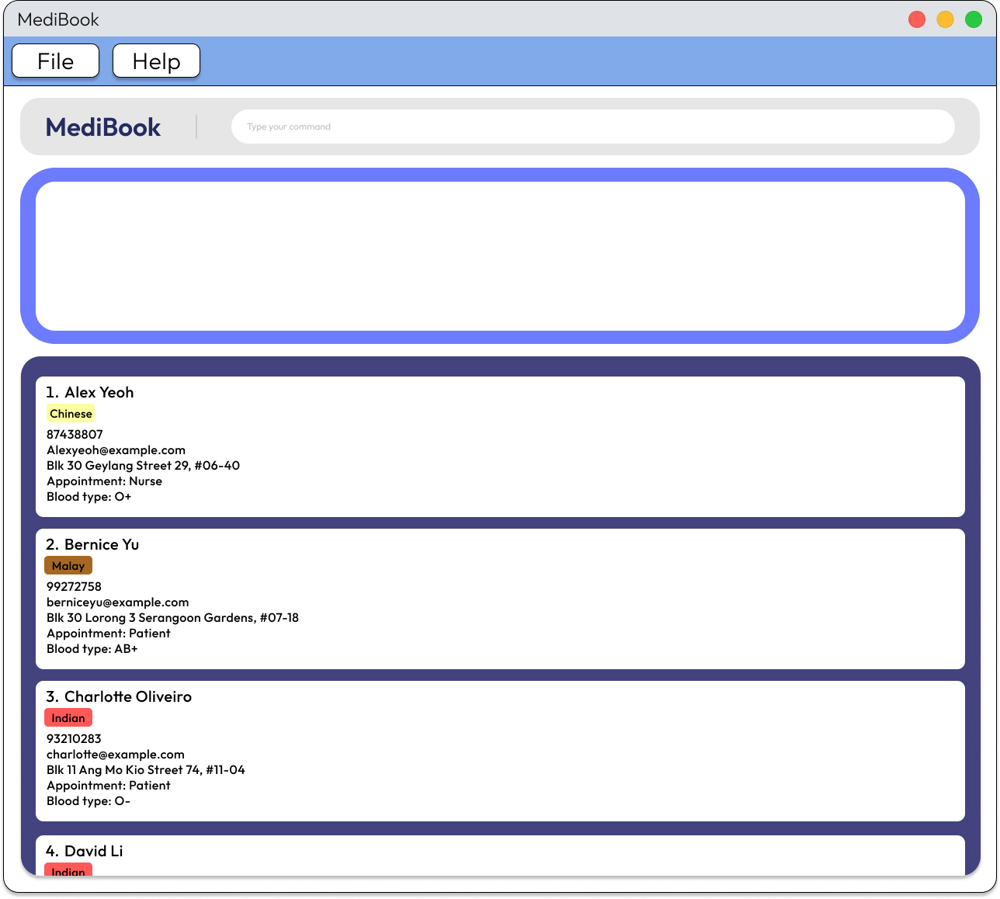
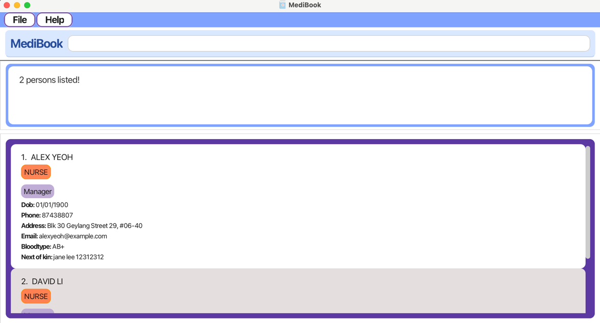

MediBook is a desktop app for managing patient and nurse records, optimized for use via a Command Line Interface (CLI), while still offering the benefits of a Graphical User Interface (GUI). Designed for speed and efficiency, MediBook empowers private nurse centres to assign staff, retrieve patient information, and manage appointments faster than traditional pen-and-paper or GUI-based systems. 

# Table of Contents
1. [Quick start](#quick-start)
2. [Features](#features)
    * [Viewing Help](#viewing-help--help)
    * [Adding a person](#adding-a-person-add)
    * [Listing all persons](#listing-all-persons--list)
    * [Editing a person](#editing-a-person--edit)
    * [Locating persons by name](#locating-persons-by-name-find)
    * [Finding patients](#finding-patient)
    * [Finding nurse](#finding-nurse)
    * [Deleting a person](#deleting-a-person--delete)
    * [Clearing all entries](#clearing-all-entries--clear)
    * [Exiting the program](#exiting-the-program--exit)
    * [Assigning a nurse to a patient](#assigning-a-nurse-to-a-patient--assign)
    * [Schedule checkups](#schedule-checkups--schedule)
    * [Viewing a nurse or patient](#viewing-a-nurse-or-patient--view)
    * [Saving the data](#saving-the-data)
    * [Editing the data file](#editing-the-data-file)
    * [Archiving data files](#archiving-data-files-coming-in-v20)
3. [FAQ](#faq)
4. [Known Issues](#known-issues)
5. [Command Summary](#command-summary)

--------------------------------------------------------------------------------------------------------------------

## Quick start

1. Ensure you have Java `17` or above installed in your Computer. 
   **Mac users:** Ensure you have the precise JDK version prescribed [here](https://se-education.org/guides/tutorials/javaInstallationMac.html).

1. Download the latest `.jar` file from [here](https://github.com/AY2425S2-CS2103T-T13-2/tp/releases).

1. Copy the file to the folder you want to use as the _home folder_ for MediBook.

1. Open a command terminal, `cd` into the folder you put the jar file in, and use the `java -jar addressbook.jar` command to run the application. 
   A GUI similar to the below should appear in a few seconds. Note how the app contains some sample data. 
   

1. Type the command in the command box and press Enter to execute it. e.g. typing **`help`** and pressing Enter will open the help window. 
   Some example commands you can try:

   * `list` : Lists all contacts.

   * `add n/John Doe p/98765432 e/johnd@example.com a/John street, block 123, #01-01 b/AB+ ap/Patient` : Adds a contact named `John Doe` to the Address Book.

   * `edit 2 b/AB-` : Edits the blood type of the 2nd contact shown in the current list.  

   * `delete 3` : Deletes the 3rd contact shown in the current list.
   
   * `assign 1 2`: Assigns the patient at index 1 to the nurse at index 2 shown in the current list.
   
   * `find nurse of 2` : Finds the nurses assigned to the 2nd contact shown in the list if they are a patient.

   * `schedule 2 25/05/2025 1100` : Schedules a check-up for the patient shown at the 2nd position of the list at the given date and time.
   * `view 4` : Displays the medical history of the patient at the 4th index in the current list.

   * `clear` : Deletes all contacts.

   * `exit` : Exits the app.

1. Refer to the [Features](#features) below for details of each command.

--------------------------------------------------------------------------------------------------------------------

## Features

**:information_source: Notes about the command format:** 

* Words in `UPPER_CASE` are the parameters to be supplied by the user. 
  e.g. in `add n/NAME`, `NAME` is a parameter which can be used as `add n/John Doe`.

* Items in square brackets are optional. 
  e.g `n/NAME [t/TAG]` can be used as `n/John Doe t/friend` or as `n/John Doe`.

* Items with `…`​ after them can be used multiple times including zero times. 
  e.g. `[t/TAG]…​` can be used as ` ` (i.e. 0 times), `t/friend`, `t/friend t/family` etc.

* Tag and Medical History allows only alphanumeric characters and spaces.

* Parameters can be in any order. 
  e.g. if the command specifies `n/NAME p/PHONE_NUMBER`, `p/PHONE_NUMBER n/NAME` is also acceptable.

* Extraneous parameters for commands that do not take in parameters (such as `help`, `list`, `exit` and `clear`) will be ignored. 
  e.g. if the command specifies `help 123`, it will be interpreted as `help`.

* If you are using a PDF version of this document, be careful when copying and pasting commands that span multiple lines as space characters surrounding line-breaks may be omitted when copied over to the application.

### Viewing help : `help`

Shows a message explaning how to access the help page.

Format: `help`

### Adding a person: `add`

Adds a person (nurse or patient) to the address book.

Format: `add n/NAME p/PHONE_NUMBER e/EMAIL a/ADDRESS b/BLOOD_TYPE ap/APPOINTMENT [t/TAG]…​ [mh/MEDICAL_HISTORY]…​`

:bulb: **Tip:**
A person can have any number of tags and medical history (including 0)

* Medical history is only for patients, an error will occur if you try to add a nurse with medical history.

Examples:
* `add n/John Doe p/98765432 e/johnd@example.com a/John street, block 123, #01-01 b/AB+ ap/Nurse t/friend`
* `add n/Betsy Crowe t/friend e/betsycrowe@example.com a/Newgate Prison p/1234567 t/criminal maniac mh/Insane, but not dangerous b/B+ ap/Patient`

### Listing all persons : `list`

Displays a list of persons in the address book. You can choose to list all persons, only patients, only nurses or all patients with checkups.

Formats:

`list` — Lists all persons (patients and nurses).

`list patient` — Lists only patients.

`list nurse` — Lists only nurses.

`list checkup` - Lists all patients with checkups.

Examples:

`list` → Shows every entry in the address book.

`list patient` → Shows only persons with the appointment role Patient.

`list nurse` → Shows only persons with the appointment role Nurse.

`list checkup` → Shows only the patients with scheduled checkups, sorted from earliest to latest checkup.

### Editing a person : `edit`

Edits an existing person (patient or nurse) in the address book.

Format: `edit INDEX [n/NAME] [p/PHONE] [e/EMAIL] [a/ADDRESS] [b/BLOOD_TYPE] [ap/APPOINTMENT] [t/TAG]…​ [mh/MEDICAL_HISTORY]…​`

* Edits the person at the specified `INDEX`. The index refers to the index number shown in the displayed person list (filtered or unfiltered). The index **must be a positive integer** 1, 2, 3, …​
* At least one of the optional fields must be provided.
* Existing values will be updated to the input values.
* When editing tags or medical history, the existing tags or medical history of the person will be removed i.e adding of tags or medical history is not cumulative.
* You can remove all the person’s tags by typing `t/` without specifying any tags after it.
* You can remove all the person’s medical history by typing `mh/` without specifying any medical history after it.
* Editing of medical history is only for patients, an error will occur if you try to edit a nurse’s medical history.
* If a change of appointment is required, patient to nurse, do ensure medical history is cleared before changing appointment. Else if nurse to patient, edit the appointment as required.

Examples:
*  `edit 1 p/91234567 e/johndoe@example.com` Edits the phone number and email address of the 1st person to be `91234567` and `johndoe@example.com` respectively.
*  `edit 2 n/Betsy Crower t/ mh/` Edits the name of the 2nd person to be `Betsy Crower` and clears all existing tags and medical history.

### Locating persons by name: `find`

Finds persons whose names contain any of the given keywords.

Format: `find KEYWORD [MORE_KEYWORDS]`

* The search is case-insensitive. e.g `hans` will match `Hans`
* The order of the keywords does not matter. e.g. `Hans Bo` will match `Bo Hans`
* Only the name is searched.
* Only full words will be matched e.g. `Han` will not match `Hans`
* Persons matching at least one keyword will be returned (i.e. `OR` search).
  e.g. `Hans Bo` will return `Hans Gruber`, `Bo Yang`

Examples:
* `find John` returns `john` and `John Doe`
* `find alex david` returns `Alex Yeoh`, `David Li` 
  

### Finding patient

Format: `find patient of nurse INDEX`

Examples:
* `find patient of nurse 1` returns `Patient Alice Pauline`

### Finding nurse

Format: `find nurse of patient INDEX`

Examples:
* `find nurse of patient 2` returns `Nurse Benson Meier`

### Deleting a person : `delete`

Deletes the specified person from the address book.

Format: `delete INDEX`

* Deletes the person at the specified `INDEX`.
* The index refers to the index number shown in the displayed person list.
* The index **must be a positive integer** 1, 2, 3, …​

Examples:
* `list` followed by `delete 2` deletes the 2nd person in the address book.
* `find Betsy` followed by `delete 1` deletes the 1st person in the results of the `find` command.

### Clearing all entries : `clear`

Clears all entries from the address book.

Format: `clear`

### Exiting the program : `exit`

Exits the program.

Format: `exit`

### Assigning a nurse to a patient : `assign`

Assigns a specified nurse to a specified patient.

Format: `assign PATIENT_INDEX NURSE_INDEX`

* Assigns the nurse at `NURSE_INDEX` to the patient at `PATIENT_INDEX`.
* `NURSE_INDEX` and `PATIENT_INDEX` both refer to the index number shown in the displayed person list.
* The index **must be a positive integer** 1, 2, 3, …​

### Schedule checkups : `schedule`

Schedules a checkup for the patient 

Format: `schedule INDEX DATE TIME`

Examples:
* `schedule 1 12/12/2025 1200` schedules a checkup for patient at index 1 on 12/12/2025 at 12:00pm

### Viewing a nurse or patient : `view`

View details of specified nurse or patient. Shows medical history of patient specified (if any).

Format: `view INDEX`

* Displays the details of the person at `INDEX`.
* If the person is a patient, then the patient's medical history is shown (if any).
* The index refers to the index number shown in the displayed person list.
* The index **must be a positive integer** 1, 2, 3, …​

### Saving the data

AddressBook data are saved in the hard disk automatically after any command that changes the data. There is no need to save manually.

### Editing the data file

AddressBook data are saved automatically as a JSON file `[JAR file location]/data/addressbook.json`. Advanced users are welcome to update data directly by editing that data file.

:exclamation: **Caution:**
If your changes to the data file makes its format invalid, AddressBook will discard all data and start with an empty data file at the next run. Hence, it is recommended to take a backup of the file before editing it. 
Furthermore, certain edits can cause the AddressBook to behave in unexpected ways (e.g., if a value entered is outside of the acceptable range). Therefore, edit the data file only if you are confident that you can update it correctly.

### Archiving data files `[coming in v2.0]`

_Details coming soon ..._

--------------------------------------------------------------------------------------------------------------------

## FAQ

**Q**: How do I transfer my data to another Computer? 
**A**: Install the app in the other computer and overwrite the empty data file it creates with the file that contains the data of your previous AddressBook home folder.

--------------------------------------------------------------------------------------------------------------------

## Known issues

1. **When using multiple screens**, if you move the application to a secondary screen, and later switch to using only the primary screen, the GUI will open off-screen. The remedy is to delete the `preferences.json` file created by the application before running the application again.
2. **If you minimize the Help Window** and then run the `help` command (or use the `Help` menu, or the keyboard shortcut `F1`) again, the original Help Window will remain minimized, and no new Help Window will appear. The remedy is to manually restore the minimized Help Window.

--------------------------------------------------------------------------------------------------------------------

## Command summary

Action | Format, Examples
--------|------------------
**Add** | `add n/NAME p/PHONE_NUMBER e/EMAIL a/ADDRESS [t/TAG]…​`   e.g., `add n/James Ho p/22224444 e/jamesho@example.com a/123, Clementi Rd, 1234665 t/friend t/colleague`
**Clear** | `clear`
**Delete** | `delete INDEX`  e.g., `delete 3`
**Edit** | `edit INDEX [n/NAME] [p/PHONE_NUMBER] [e/EMAIL] [a/ADDRESS] [t/TAG]…​`  e.g.,`edit 2 n/James Lee e/jameslee@example.com`
**Find** | `find KEYWORD [MORE_KEYWORDS]`  e.g., `find James Jake`
**List** | `list` `list nurse` `list patient` `list checkup`
**Help** | `help`
**Assign** | `assign PATIENT_INDEX NURSE_INDEX`  e.g., `assign 2 1`
**Schedule** | `schedule PATIENT_INDEX DATE_TIME`
**View** | `view INDEX`  e.g., `view 2`
